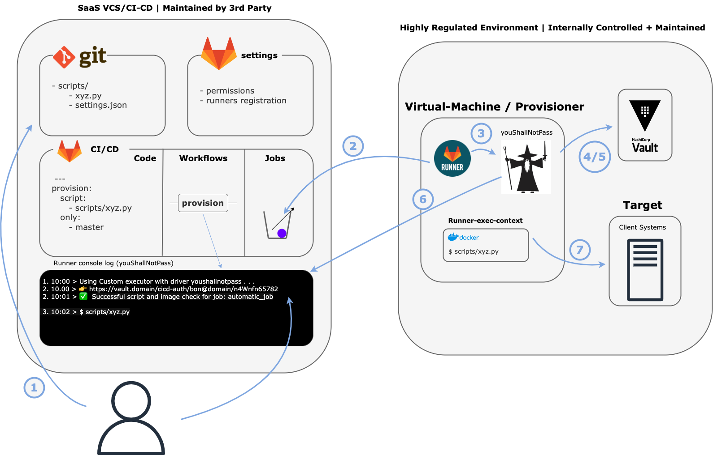
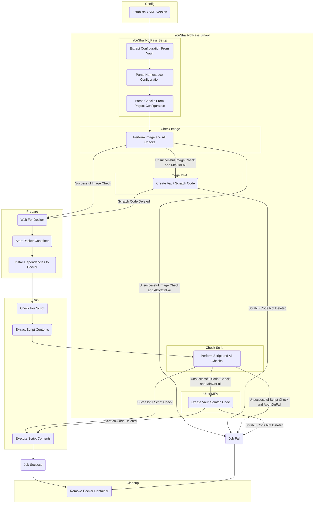
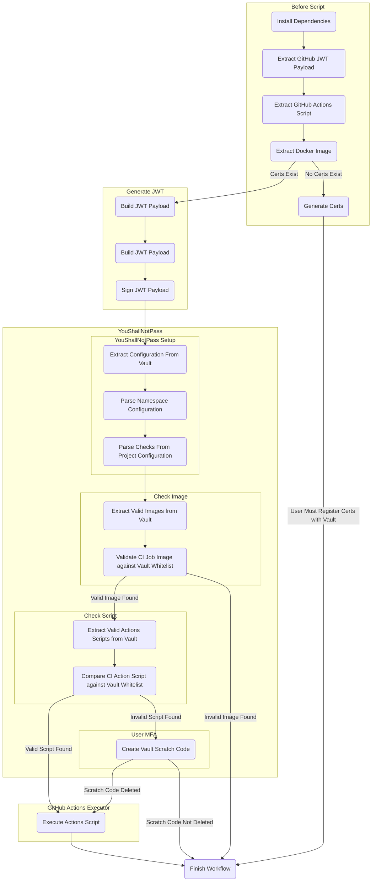

# YouShallNotPass

YouShallNotPass brings an added level of execution security to mission-critical CI/CD Systems.

## TL;DR

YouShallNotPass executes administrator specified checks on CI/CD pipelines to prevent unauthorized workflows from executing commands on sensitive systems.


## Contents

- [YouShallNotPass](#youshallnotpass)
  - [TL;DR](#tldr)
  - [Contents](#contents)
  - [Example Use Case](#example-use-case)
    - [Example Setup](#example-setup)
      - [Project Config](#project-config)
    - [Workflow](#workflow)
  - [Configuration](#configuration)
    - [Description](#description)
    - [Namespace Configuration](#namespace-configuration)
      - [Namespace Configuration Location](#namespace-configuration-location)
      - [Namespace Configuration Options](#namespace-configuration-options)
      - [Namespace Configuration Examples](#namespace-configuration-examples)
    - [Project Configuration](#project-configuration)
      - [Project Configuration Setup](#project-configuration-setup)
      - [Project Configuration Options](#project-configuration-options)
      - [Project Configuration Examples](#project-configuration-examples)
      - [Project Configuration Append](#project-configuration-append)
  - [GitLab Runner Setup](#gitlab-runner-setup)
    - [Description](#description-1)
    - [Steps](#steps)
  - [GitLab Runner JWT and JWT V2 Migration](#gitlab-runner-jwt-and-jwt-v2-migration)
    - [Description](#description-2)
    - [Steps:](#steps-1)
  - [GitHub Support (Experimental)](#github-support-experimental)
    - [Description](#description-3)
    - [Setup](#setup)
  - [Building From Source](#building-from-source)
    - [GitLab](#gitlab)
    - [GitHub](#github)
  - [YouShallNotPass Arguments](#youshallnotpass-arguments)
  - [Detailed GitLab Workflow Diagram](#detailed-gitlab-workflow-diagram)
  - [Detailed GitHub Workflow Diagram](#detailed-github-workflow-diagram)
  - [Contributing](#contributing)
  - [Technical Debt](#technical-debt)
  - [Testing](#testing)
  - [License](#license)


## Example Use Case

When clients systems are provisioned, the provisioning is often done with the same script by some authorized user. In this case, it is important that the client provisioning script does not change (in unexpected ways) and that an authorized user has initiated the workflow.


### Example Setup


#### Project Config

```json
{
  "jobs": [
    {
      "jobName": "provisioning_job",
      "checks": [
        {
          "name": "imageHash",
          "options": {
            "abortOnFail": true
          }
        },
        {
          "name": "scriptHash",
          "options": {
            "abortOnFail": true
          }
        },
        {
          "name": "mfaRequired",
          "options": {
            "checkType": "all"
          }
        }
      ]
    }
  ]
}
```


### Workflow



1. The client provisioning workflow is triggered.
2. The YouShallNotPass Runner picks up the job.
3. The GitLab Runner utilizes the YouShallNotPass binary and extracts necessary information from the environment.
4. The GitLab Runner investigates the user's vault config and realizes it will be conducting an imageHash, scriptHash, and mfaRequired check on the job.
5. The GitLab Runner conducts all of the checks in parallel and returns that the user must delete a scratch code to authenticate.
6. The user deletes the scratch code letting the YouShallNotPass Runner know the job is authorized.
7. The GitLab Runner spins up the docker image and runs the executable script on the client machine to provision the new user.


## Configuration


### Description

Often it may be necessary to specify the configuration of YouShallNotPass for namespaces (i.e. logging) or projects (i.e. job-specific checks). In this spirit, YouShallNotPass offers the ability to parse vault secrets into updated policies.


### Namespace Configuration

Namespace configuration is meant to establish properties that are shared throughout the various projects touched by the YouShallNotPass runner.  For example, say every project in a specific namespace should alert a specific Mattermost channel on successful (or unsuccessful) execution.  In this case, it does not make sense to set this configuration for every specific project and, instead, this configuration can be set up in the vault.


#### Namespace Configuration Location

The namespace configuration should exist as a secret in the vault at the following path:
  - {mount}/{namespace}/youshallnotpass_config


#### Namespace Configuration Options

Options:
```sh
logger: the specific logging client to be utilized
  -> console: the logs should be printed to the console
  -> mattermost: the logs should be printed to a Mattermost instance with the following configuration:
    -> url: the Mattermost instance url
    -> token: the token used to authenticate with the Mattermost instance
    -> channelId: the channel id to send logs to
```

#### Namespace Configuration Examples

```json
{
  "logger": {
    "name": "console"
  }
}
```

```json
{
  "logger": {
    "name": "mattermost",
    "options": {
      "url": "http://127.0.0.1:8000",
      "token": "1234567890",
      "channelId": "channel_id"
    }
  }
}
```


### Project Configuration

Project configuration is meant to establish properties that are specific to certain CI/CD Jobs. For example, it may not be necessary for a job to perform script validation or maybe a job will change image hashes frequently enough that user mfa should only be required for failed image checks.


#### Project Configuration Setup

The project configuration file for each project should be created as a secret in the vault at the following path:
  -{mount}/{namespace}/{project}/youshallnotpass_config


#### Project Configuration Options

Options:
```yaml
imageHash: check the hash of the docker image against hashes in the vault whitelist
  -> abortOnFail: if true, the CI/CD Job execution will fail if this check fails
  -> mfaOnFail: if true, the CI/CD Job will require user MFA if this check fails
scriptHash: check the hash of the execution script against hashes in the vault whitelist
  -> abortOnFail: if true, the CI/CD Job execution will fail if this check fails
  -> mfaOnFail: if true, the CI/CD Job will require user MFA if this check fails
mfaRequired: requires every run with specified type to require mfa to run
  -> checkType: the type of check to require mfa to run (options: image, script, all) (default: all)
dateTimeCheck: requires the CI/CD Job to be executed at/within a date and time
  -> scale: ["daily", "weekly", "monthly", "yearly"] the time scale for the job (i.e. a daily job is executed every day and yearly job is executed every year)
  -> intervals: the days of the scale to allow job execution (i.e. if the scale is "weekly" then an interval of 3 is every Wednesday (day 3) or an interval of [0, 5] is every Sunday (day 0) and Friday (day 5))
  -> tolerance: the amount of seconds between the start of allowed execution and the end (i.e. a tolerance of 300 means there is a 5 minute window where the CI/CD job can be run)
  -> time: When the time interval for executing the job begins ("HH:MM:SS")
  -> abortOnFail: if true, the CI/CD Job execution will fail if this check fails
  -> mfaOnFail: if true, the CI/CD Job will require user MFA if this check fails
```


#### Project Configuration Examples

```json
{
  "jobs": [
    {
      "jobName": "test_job_1",
      "checks": [
        {
          "name": "imageHash",
          "options": {
            "abortOnFail": false,
            "mfaOnFail": true
          }
        }
      ]
    },
    {
      "jobName": "test_job_2",
      "checks": [
        {
          "name": "scriptHash",
          "options": {
            "abortOnFail": true,
          }
        },
        {
          "name": "imageHash",
          "options": {
            "abortOnFail": false,
            "mfaOnFail": true
          }
        }
      ]
    }
  ]
}
```


#### Project Configuration Append

For projects that are not listed in the project config, they will use the following default profile (if you make another default job it will override this default)

```json
{
  "jobName": "default",
  "checks": [
    {
      "name": "imageHash",
      "options": {
        "abortOnFail": true
      }
    },
    {
      "name": "scriptHash",
      "options": {
        "abortOnFail": false,
        "mfaOnFail": true
      }
    }
  ]
}
```


## GitLab Runner Setup


### Description

For GitLab, the custom executor is used to run our custom


### Steps

1. Download the latest `youshallnotpass` binary and `gitlab_custom_executor.zip` file from the releases section of this project, copy and extract the contents into a directory `/path/to/gitlab-runner/` on the machine where you want to install the GitLab runner. Make sure the scripts are executable. In addition, create two directories in `/path/to/gitlab-runner/`: builds, and cache.

2. Update the profile.sh information from the GitLab executor release you downloaded earlier.

```sh
export YOUSHALLNOTPASS_VAULT_ROOT="your_mount_root"
export VAULT_ROLE="your-default-role"
export VAULT_LOGIN_PATH="auth/jwt/gitlab.example.com/login"
export VAULT_ADDR="http://your_vault_address"
export VAULT_EXTERNAL_ADDR="Same as Vault Addr, only different for local testing"
```

3. Follow the GitLab instructions to download the runner and then register it to utilize the custom executor

```sh
gitlab-runner register \
  --url https://gitlab.example.com/ \
  --registration-token yourgitlabprojectstoken \
  --name "YouShallNotPass Custom-Executor Runner" \
  --executor custom \
  --builds-dir "/path/to/gitlab-runner/builds" \
  --cache-dir "/path/to/gitlab-runner/cache" \
  --custom-config-exec "/path/to/gitlab-runner/config.sh" \
  --custom-prepare-exec "/path/to/gitlab-runner/prepare.sh" \
  --custom-run-exec "/path/to/gitlab-runner/run.sh" \
  --custom-cleanup-exec "/path/to/gitlab-runner/cleanup.sh"
```

Note that GitLab is deprecating `--registration-token` to use `--token` so choose appropriately depending on how/when you do this.

4. Add an ID Token named VAULT_ID_TOKEN or CI_JOB_JWT with the vault instance address as the audience claim (if both present VAULT_ID_TOKEN takes priority over CI_JOB_JWT)

```yaml
stages:
  - test

# or your own docker image
image: alpine:3.18.4@sha256:eece025e432126ce23f223450a0326fbebde39cdf496a85d8c016293fc851978

test_job:
  stage: test
  id_tokens:
    VAULT_ID_TOKEN:
      aud: ["http://gitlab.example.com"]
  script:
    - echo "Vault Token Example"

test_job_two:
  stage: test
  id_tokens:
    CI_JOB_JWT:
      aud: ["http://gitlab.example.com"]
  script:
    - echo "CI Job JWT Token Example"
```

5. Enable JWT Authentication with your Hashicorp Vault Instance

```sh
vault auth enable -path=jwt/gitlab.example.com jwt
```

6. Configure JWT Authentication to use the gitlab oidc discovery url and a default role you will configure in step 7

```sh
vault write auth/jwt/gitlab.example.com/config \
  bond_issuer="gitlab.example.com" \
  default_role="your-default-role" \
  oidc_discovery_url="https://gitlab.example.com"
```

7. Configure the default role you created in step 6 using the audience from step 4 and your GitLab projects namespace path in `<project_namespace>` only. Make sure in the bound_audiences to put your GitLab URL.

```sh
vault write auth/jwt/gitlab.example.com/role/your-default-role -<<EOF
{
  "policies": "gitlab",
  "ttl": "1h",
  "user_claim": "user_login",
  "role_type": "jwt",
  "bound_audiences": ["https://gitlab.example.com"],
  "bound_claims": {
    "namespace_path": "<project_namespace>"
  },
  "claim_mappings": {
    "instance": "iss",
    "namespace_id": "namespace_id",
    "namespace_path": "namespace_path",
    "project_id": "project_id",
    "project_path": "project_path"
  }
}
EOF
```

8. Write a vault policy for the jwt login that establishes a project whitelist, namespace whitelist, and scratch path with the following capabilities

```sh
JWT_ACCESSOR=$(vault auth list -format=json | jq -r '.["jwt/gitlab.example.com/"].accessor')

cat << EOF >> policy.hcl
path "your_mount_root/{{ identity.entity.aliases.$JWT_ACCESSOR.metadata.project_path }}/whitelist" {
  capabilities = ["read", "list"]
}
path "your_mount_root/{{ identity.entity.aliases.$JWT_ACCESSOR.metadata.namespace_path }}/whitelist" {
  capabilities = ["read", "list"]
}
path "your_mount_root/{{ identity.entity.aliases.$JWT_ACCESSOR.metadata.project_path }}/youshallnotpass_config" {
  capabilities = ["read", "list"]
}
path "your_mount_root/{{ identity.entity.aliases.$JWT_ACCESSOR.metadata.namespace_path }}/youshallnotpass_config" {
  capabilities = ["read", "list"]
}
path "your_mount_root/{{ identity.entity.aliases.$JWT_ACCESSOR.metadata.project_path }}/scratch/*" {
  capabilities = ["create", "read", "delete"]
}
EOF

vault policy write gitlab policy.hcl
```

9. Enable the secrets KV storage at the mount root in step 8

```sh
vault secrets enable -path=your_mount_root kv
```

10. Write a list of namespace allowed images to the namespace whitelist

```sh
echo -n '{
  "allowed_images": [
    "alpine:3.18.4@sha256:eece025e432126ce23f223450a0326fbebde39cdf496a85d8c016293fc851978"
  ]
}' | vault kv put your_mount_root/your_gitlab/project_namespace/whitelist -
```

11. Write a list of project allowed images and scripts to the project whitelist

```sh
echo -n '{
  "allowed_images": [
    "alpine:3.18.4@sha256:eece025e432126ce23f223450a0326fbebde39cdf496a85d8c016293fc851978"
  ],
  "allowed_scripts": [
    "allowed_project_script_1@sha256:...",
    "allowed_project_script_2@sha256:...",
    "..."
  ]
}' | vault kv put your_mount_root/your_gitlab/project_namespace/project_name/whitelist -
```

12. Start the GitLab runner with `gitlab-runner run`

You should see the runner online on the repo Settings > CI/CD > Runners.

13. Execute Jobs on the custom runner with the extra layer of security.


## GitLab Runner JWT and JWT V2 Migration


### Description

As of GitLab 15.7, JWT and JWT V2 tokens have been deprecated in favor of Id Tokens. Therefore, it may be necessary for some previous users to migrate to the new ID Token system. <b>This tutorial assumes the user would like to migrate the current JWT auth role to OIDC ID tokens. If you would instead like to create a new auth url for the new ID Token, please follow the GitLab Runner Setup steps 2-6.</b>


### Steps:

1. Add the VAULT_ID_TOKEN or CI_JOB_JWT Token Id Token to GitLab Jobs with Vault address as the audience. (if both present VAULT_ID_TOKEN takes priority)

```sh
steps:
  - build

migrated_job:
  stage: build
  image: image
  id_tokens:
    VAULT_ID_TOKEN or CI_JOB_JWT:
      aud: ["http://vault:8200"]
```

2. Update the config of the previous jwt vault auth url to use the oidc_discovery_url.

```sh
vault write auth/jwt/gitlab.example.com/config \
  bond_issuer="gitlab.example.com" \
  default_role="default_role" \
  oidc_discovery_url="https://gitlab.example.com"
```

3. Update the default role to have the desired bound_audience specified in step 1

```sh
vault write auth/jwt/gitlab.example.com/role/default_role -<<EOF
{
  "policies": "gitlab",
  "ttl": "1h",
  "user_claim": "user_login",
  "role_type": "jwt",
  "bound_audiences": ["http://vault:8200"],
  "bound_claims": {
    "namespace_path": "your_gitlab/project_path"
  },
  "claim_mappings": {
    "instance": "iss",
    "namespace_id": "namespace_id",
    "namespace_path": "namespace_path",
    "project_id": "project_id",
    "project_path": "project_path"
  }
}
EOF
```

4. Execute Jobs on the custom runner with the extra layer of security.


## GitHub Support (Experimental)


### Description

Currently, we are experimenting with Github support for YouShallNotPass. This GitHub executor wraps the current GitHub executor with the same level of security as the GitLab executor. This takes place in the form of a "before-script" which screens both the GitHub actions to be run and the image to be used to run such actions (on a linux machine).


### Setup

Note that the current limitation is this works for public repositories. For private repos, you will need to modify the `before_script.sh` to provide the appropriate token.

0. Follow [GitHub Self-Hosted Runner Instructions](https://docs.github.com/en/actions/hosting-your-own-runners/managing-self-hosted-runners/adding-self-hosted-runners)

1. Download the relevant release from the release section of this project, copy and extract the contents into another folder than actions-runner on your GitHub runner. The following scripts should now exist in the actions-runner folder of your GitHub runner.

  - before_script.sh <- from YouShallNotPass
  - generate_jwt.sh <- from YouShallNotPass
  - profile.sh <- from YouShallNotPass

2. Make sure before_script.sh, generate_jwt.sh, and profile.sh have the correct execution privileges (namely make sure they can be executed).

3. Edit the .env file from the actions-runner folder to contain the following:

```sh
ACTIONS_RUNNER_HOOK_JOB_STARTED=/your/absolute/path/to/before_script.sh
```

According to [GitHub documentation](https://docs.github.com/en/actions/hosting-your-own-runners/managing-self-hosted-runners/running-scripts-before-or-after-a-job#triggering-the-scripts), these scripts should not be in the actions-runner folder.

4. Run before_script.sh to download the necessary dependencies and generate a public-private key pair for the runner.

5. Enable JWT Authentication with your Hashicorp Vault Instance

```sh
vault auth enable -path=jwt/github.com jwt
```

6. Configure JWT authentication to use the public key you just generated in the *certs/public-key.pem* file.

```sh
vault write auth/jwt/github.com/config \
  bond_issuer="github.com" \
  default_role="your-default-role" \
  jwt_validation_pubkeys="$(cat path/to/certs/public-key.pem)"
```

7. Configure the default role you created in step 6 using your GitLab projects namespace path.

```sh
vault write auth/jwt/github.com/role/your-default-role -<<EOF
{
  "policies": "github",
  "ttl": "1h",
  "user_claim": "user_login",
  "role_type": "jwt",
  "bound_claims": {
    "namespace_path": "you_github_user"
  },
  "claim_mappings": {
    "instance": "iss",
    "namespace_id": "namespace_id",
    "namespace_path": "namespace_path",
    "project_id": "project_id",
    "project_path": "project_path"
  }
}
EOF
```

8. Write a vault policy for the jwt login that establishes a project whitelist, namespace whitelist, and scratch path with the following capabilities

```sh
JWT_ACCESSOR=$(vault auth list -format=json | jq -r '.["jwt/github.com/"].accessor')

cat << EOF >> policy.hcl
path "your_mount_root/{{ identity.entity.aliases.$JWT_ACCESSOR.metadata.project_path }}/whitelist" {
  capabilities = ["read", "list"]
}
path "your_mount_root/{{ identity.entity.aliases.$JWT_ACCESSOR.metadata.namespace_path }}/whitelist" {
  capabilities = ["read", "list"]
}
path "your_mount_root/{{ identity.entity.aliases.$JWT_ACCESSOR.metadata.project_path }}/youshallnotpass_config" {
  capabilities = ["read", "list"]
}
path "your_mount_root/{{ identity.entity.aliases.$JWT_ACCESSOR.metadata.namespace_path }}/youshallnotpass_config" {
  capabilities = ["read", "list"]
}
path "your_mount_root/{{ identity.entity.aliases.$JWT_ACCESSOR.metadata.project_path }}/scratch/*" {
  capabilities = ["create", "read", "delete"]
}
EOF

vault policy write github policy.hcl
```

9. Enable the secrets kv storage at the mount root in step 8

```sh
vault secrets enable -path=your_mount_root kv
```

10. Write a list of namespace allowed images to the namespace whitelist

```sh
echo -n '{
  "allowed_images": [
    "allowed_namespace_image_1@sha256:...",
    "allowed_namespace_image_2@sha256:...",
    "..."
  ]
}' | vault kv put your_mount_root/your_github_username_or_organization/whitelist -
```

11. Write a list of project allowed images and scripts to the project whitelist

```sh
echo -n '{
  "allowed_images": [
    "allowed_project_image_1@sha256:...",
    "allowed_project_image_2@sha256:...",
    "..."
  ],
  "allowed_scripts": [
    "allowed_project_script_1@sha256:...",
    "allowed_project_script_2@sha256:...",
    "..."
  ]
}' | vault kv put your_mount_root/your_github_username_or_organization/project_name/whitelist -
```

12. Update the profile.sh information from the GitHub executor.

```sh
export YOUSHALLNOTPASS_VAULT_ROOT="your_mount_root"
export VAULT_ROLE="your-default-role"
export VAULT_LOGIN_PATH="auth/jwt/github.com/login"
export VAULT_ADDR="http://your_vault_address"
export VAULT_EXTERNAL_ADDR="Same as Vault Addr, only different for local testing"
```

13. update your GitHub workflows to utilize the new custom runner

```yaml
name: GitHub Actions Test
run-name: Test Action
on: [push]
jobs:
  Test-Action:
    runs-on: self-hosted
    steps:
      - ...
```


## Building From Source


### GitLab

To build from source for the GitLab executor, fill in the custom_executors/gitlab_custom_executor/profile.sh and build the Dockerfile in the base repo.


### GitHub

To setup the GitHub executor simply build the youshallnotpass binary with:
```bash
go build -o youshallnotpass
```
and follow the directions given in the [GitHub Support](#github-support-experimental) section.


## YouShallNotPass Arguments

```sh
NAME:
   youshallnotpass validate-token - validate-token <flags>

USAGE:
   youshallnotpass validate-token [command options] [arguments...]

DESCRIPTION:
   Validate Token

OPTIONS:
   --ci-job-image value          (default: CI Pipeline Docker Container used to Execute the CI job) [$CI_JOB_IMAGE, $CUSTOM_ENV_CI_JOB_IMAGE]
   --ci-project-path value       (default: Path to the Repo) [$CI_PROJECT_PATH, $CUSTOM_ENV_CI_PROJECT_PATH]
   --ci-project-namespace value  (default: Namespace of the Repo) [$CI_PROJECT_NAMESPACE, $CUSTOM_ENV_CI_PROJECT_NAMESPACE]
   --ci-pipeline-id value        (default: ID of the CI pipeline job) [$CI_PIPELINE_ID, $CUSTOM_ENV_CI_PIPELINE_ID]
   --ci-job-script value         (default: CI Job Script to Run) [$RUNNER_SCRIPT]
   --ci-job-name value           (default: Name of the CI Job) [$CI_JOB_NAME, $CUSTOM_ENV_CI_JOB_NAME]
   --ci-user-email value         (default: Email of the User Executing the CI job (Username on GitHub)) [$CI_USER_EMAIL]
   --ci-platform value           (default: The CI/CD platform being used to run this job (i.e. GitHub, GitLab, ...))
   --vault-addr value            (default: URL Address of the Vault Server (i.e. http://vault.example.com)) [$VAULT_ADDR]
   --vault-external-addr value   (default: Same as Vault Addr (Different in Local Testing)) [$VAULT_EXTERNAL_ADDR]
   --vault-client value          (default: Secure Key-Value Storage Client (i.e. Hashicorp)) [$VAULT_CLIENT]
   --vault-role value            (default: Vault role for Authentication) [$VAULT_ROLE]
   --vault-login-path value      (default: Path to Login to the Vault Instance (must be JWT enabled)) [$VAULT_LOGIN_PATH]
   --vault-token value           (default: Token to Authenticate with Vault (Optional)) [$VAULT_TOKEN]
   --jwt-token value             (default: JWT for the CI Job) [$VAULT_ID_TOKEN, $CUSTOM_ENV_VAULT_ID_TOKEN, $CI_JOB_JWT, $CUSTOM_ENV_CI_JOB_JWT]
   --pre-validation-token value  (default: Random String Generated By YouShallNotPass for Multi-Step Scripts) [$YOUSHALLNOTPASS_PREVALIDATION_TOKEN]
   --check-type value            (default: The type of check to run at this stage (auto generated in the custom executor))
   --help, -h                    show help
```


## Detailed GitLab Workflow Diagram




## Detailed GitHub Workflow Diagram




## Contributing

See [CONTRIBUTING.md](CONTRIBUTING.md)


## Technical Debt
- Color Checking for Image Hash + Script in GitLab Executor (see ./custom_executors/gitlab_custom_executor/run.sh lines 22-44)
    - When processing the GitLab execution script (`before_script`, `script`, and `after_script` fields of the job in `.gitlab-ci.yml`), the script to be executed is printed to the GitLab Runner terminal in green before it is executed.  Therefore, the most easily accessible way of determining the contents of the script includes stripping out the green text. This is listed here under technical debt as it is possible for this to change in future GitLab Executor releases.


## Testing

The full documentation of the testing workflows can be found [here](TESTING.md).


## License

Copyright (c) 2023 Kudelski Security

Permission is hereby granted, free of charge, to any person obtaining a copy of this software and associated documentation files (the "Software"), to deal in the Software for non-commercial research and internal development purposes, including without limitation the rights to use, copy, modify, merge, publish, distribute, and/or sublicense the Software for such purposes, and to permit persons to whom the Software is furnished to do so, subject to the following conditions:

The above copyright notice and this permission notice shall be included in all copies or substantial portions of the Software.

For any use unrelated to non-commercial research and internal development of the Software, a separate permission must be obtained from the Copyright holder.

THE SOFTWARE IS PROVIDED "AS IS", WITHOUT WARRANTY OF ANY KIND, EXPRESS OR IMPLIED, INCLUDING BUT NOT LIMITED TO THE WARRANTIES OF MERCHANTABILITY, FITNESS FOR A PARTICULAR PURPOSE AND NONINFRINGEMENT. IN NO EVENT SHALL THE AUTHORS OR COPYRIGHT HOLDERS BE LIABLE FOR ANY CLAIM, DAMAGES OR OTHER LIABILITY, WHETHER IN AN ACTION OF CONTRACT, TORT OR OTHERWISE, ARISING FROM, OUT OF OR IN CONNECTION WITH THE SOFTWARE OR THE USE OR OTHER DEALINGS IN THE SOFTWARE.
